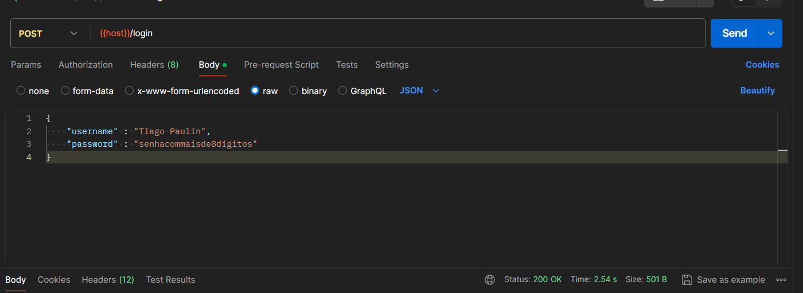
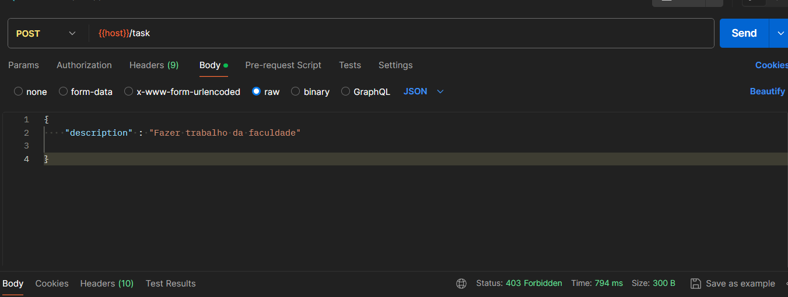
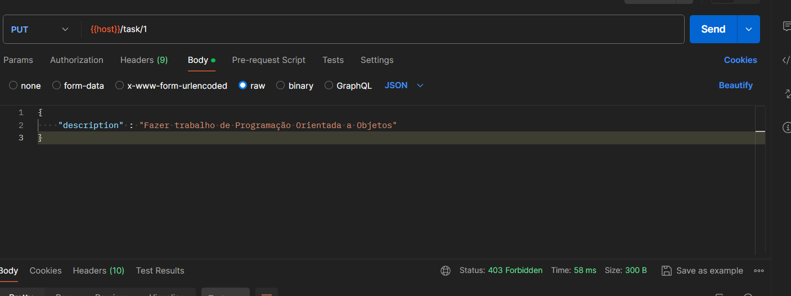
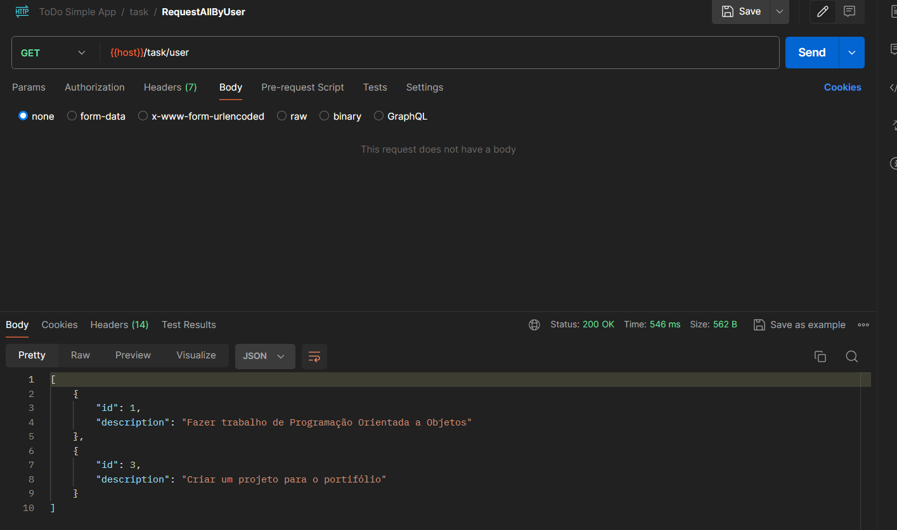

# TO DO List API RESTful

## Sobre a aplicação

A aplicação é uma API RESTful que oferece uma plataforma para gerenciamento de tarefas. Após o cadastro, os usuários podem fazer login no sistema para acessar e gerenciar suas listas de tarefas de forma eficiente.
O sistema implementa todas as operações CRUD (Criar, Ler, Atualizar e Deletar) via requisições HTTP, permitindo aos usuários criar, atualizar, requisitar e excluir tanto tarefas quanto informações de usuário.
Além disso, os status HTTP são adequadamente tratados para garantir uma experiência consistente e confiável para o usuário durante o uso da aplicação.
Para garantir a segurança dos dados, foi incorporado o Spring Security para autenticação e autorização dos usuários. Isso significa que cada usuário só pode acessar suas próprias tarefas, utilizando o token gerado durante o processo de login. Portanto, não há autorização para acessar as tarefas de outros usuários, garantindo a privacidade e segurança dos dados.

## Funcionamento da aplicação

Executando no postman todas as requisições implementas na aplicação mostrando os resultados em cada caso e o status da requisição http.

### CREATE do usuário

A para a criação de um usuário, deve-se seguir alguns critérios, o nome de usuário não pode ser vazio nem nulo e deve conter de 3 a 100 caracteres, já a senha, assim como o nome de usuário não pode ser vazia nem nula e ter entre 8 a 100 caracteres. Além disso, não é possível cadastrar um usuário com um nome que já exista na base de dados.

* Criando usuário com nome e senha vazios

Satus retornado: 400, Bad Request

* Criando usuário com nome menor que 3 digitos e senha menor que 8 digitos

Satus retornado: 400, Bad Request

* Criando usuário com nome maior que 3 dígitos e senha maior que 8 dígitos

Status retornado: 201, Created
Persistência no Banco de Dados:

* Criando um usuário com nome que já existe na base de dados

Status retornado: 409, Conflict

### LOGIN de usuário

Uma vez Criado, para a realização das outras operações o usuário deve realizar login com seu email e senha no sistema para obter o token de atentificação de usuário para que sejam delegadas as permissões prar criação e manipulação de tarefas bem como modificar ou deletar a própria conta

* Realizando Login com nome e senha incorretos

Status retornado: 401, Unauthorized

* Realizando Login com nome e senha corretos

Status retornado: 200, OK
O Token de acesso será retornado em um Header e ele será necessário para que o usuário realize as demais operações

### UPDATE de usuário

Na aplicação em questão, a regra de negócio só permite que o usuário realize a modificação de sua senha

* Modificando a senha do usuário sem passar o token de autenticação no header

Status retornado: 403, Forbidden

* Modificando a senha do usuário passando o token de autenticação no header

Inserindo o token

Status retornado: 204, No Content

* Tentando Logar com a senha antiga

Status retornado: 401, Unauthorized

* Tentando modificar a senha de outro usuário

Criando outro usuário

Ainda com o primeiro usuário logado, tentar trocar a senha de outro usuário passando o id dele no endpoint

### REQUEST de usuário
Para exibir os dados de um usuário é só realizar o GET passando o id do usuário no endpoint, na aplicação as únicas informações retornadas são o id e o username

* Request de usuário sem o token de autentificação

Status retornado: 403, Forbidden

* Request de usuário passando o token de athenticação pelo header

Inserindo o Token no header

Realizando a requisição

Status retornado: 200, OK

* Request dos dados de outro usuário

Ainda com o primeiro usuário logado, tentar consultar os dados de outro usuário passando o id dele no endpoint

Status retornado: 403, Forbidden

### DELETE de Usuário
O usuário pode deletar suas informações do banco de dados

* Deletando o usuário sem passar o token de autenticação no header

Status retornado: 403, Forbidden

* Tentando deletar outro usuário da base de dados

Inserir o token de autenticação no header

Realizar o operação de delete passando o id de outro usuário no endpoint

Status retornado: 403, Forbidden

* Deletando o usuário passando o token de autenticação no header

Inserir o token de autenticação no header

Realizar a operação de delete

Status retornado: 204, No Content

Resultado no banco de dados

### CREATE de tarefas
Uma vez logado o usuário pode criar sus tarefas, quando criadas as tarefas são armazenadas no banco associadas ao id do usuário

* Criando uma task sem estar logado

Status retornado: 403, Forbidden

* Criando uma task logado no sistema

Adicionando o token de autenticação

Criando a task

Status retornado: 201, Created

Resultado no banco de dados

### UPDATE de tarefas
O usuário pode alterar a descrição de tarefas criadas por ele

* Atualizar a descrição de uma tarefa sem estar logado

Status retornado: 403, Forbidden

* Atualizar a descrição de uma tarefa logado na aplicação

Adicionando o token de autenticação

Realizando operação de atualizar descrição

Status retornado: 204, No Content

Resultado no Banco de dados

* Tentar atualizar a descrição de um tarefa de outro usuário

Criando mais tarefas para o usuário de id 4

Logando com outro usuário

Com o outro usuário logado, atualizar a task de id 2 que pertence ao usuário de id 4

Status retornado: 403, Forbidden

### DELETE de tarefa

* Tentando deletar a tarefa de outro usuário

Logado com o outro usuário passando no endpoind o id de uma tarefa do usuário de id 4

Status retornado: 403, Forbidden

* Passando o id de uma task q não existe no endpoint da requisição

Status retornado: 404, Not Found

* Deletando a task de um usuário logado

Adicionando o token de autenticação no header

Deletando a task de id 2

Status retornado: 204, No Content

Resultado no bando de dados

### REQUEST de tarefas
Na aplicação é possível realizar a busca de uma tarefa em específico ou todas as tarefas relacionadas a um usuário

* Passando o id de uma tarefa que não existe no endpoint da requisição

Status retornado: 404, Not Found

* Fazendo o request de uma tarefa

Status retornado: 200, OK

* Request de todas as tarefas de um usuário

Status retornado: 200, OK

* Tentando fazer request de uma tarefa de outro usuário

Adicionando o token de autenticação de outro usuário

Realizando o request da task de id 1 que pertence ao usuário de id 4

Status retornado: 403, Forbidden